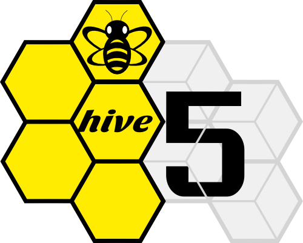

Hello!

Hive5 is a small hackerspace in the city of Groningen. It was founded on
Februari 2013 by three enthusiastic techies. We keep ourselves busy with
programming, system administration and other software related topics.

Interested? Feel free to visit our [IRC][1] channel: `#Hive5` on
`irc.zeronode.net/6697` (an SSL connection is required) or just click
[this link][2]. You can also subscribe to the mailing list by sending an email
to `hive5-request [at] freelists [dot] org`. Or through the [web interface][3].
Send an email to `hive5 [at] freelists [dot] org` to post to the mailinglist.
If you would like to contact us you can send an email to
`info [at] hive5 [dot] nl`.

[1]: http://www.irchelp.org/irchelp/irctutorial.html
[2]: irc://irc.zeronode.net:+6697/#Hive5
[3]: http://www.freelists.org/list/hive5

Schedule
--------

Unscheduled activities occur on average once per week. All activities are
announced on the mailinglist. And when hacking at members, the following holds:
BYOD (Bring Your Own Device) and PYOP (Pay Your Own Pizza). See the
[The Archive]({{url}}/archive.html) for past events.

Members
-------

Who are (some of) the members? See [members]({{url}}/members.html).
